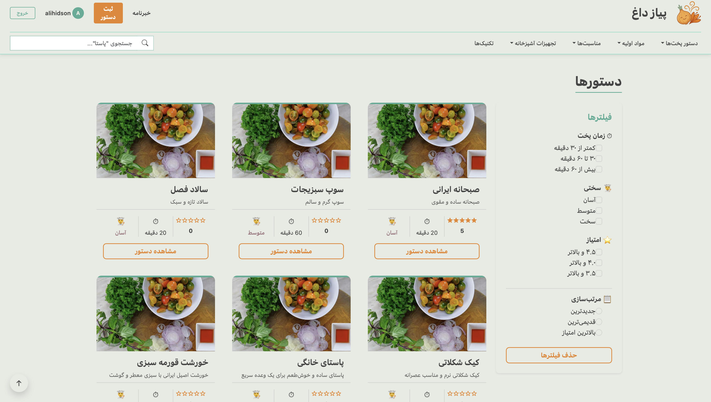
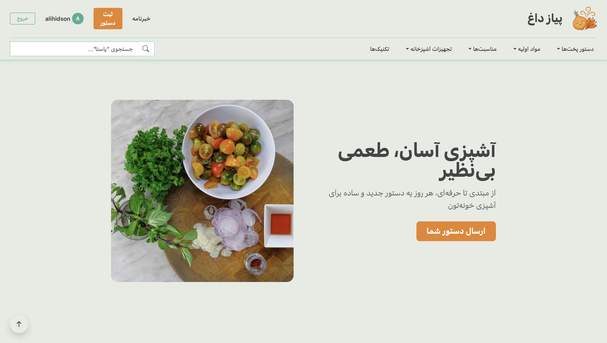
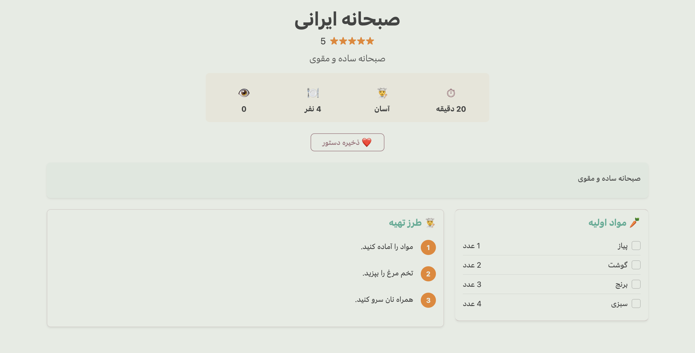
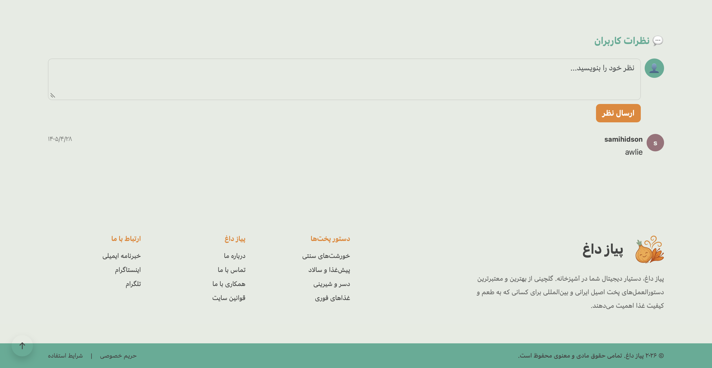
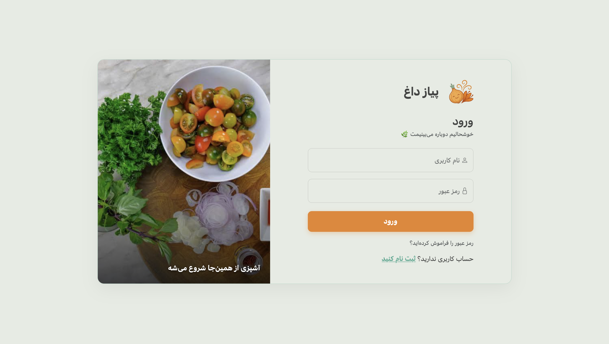
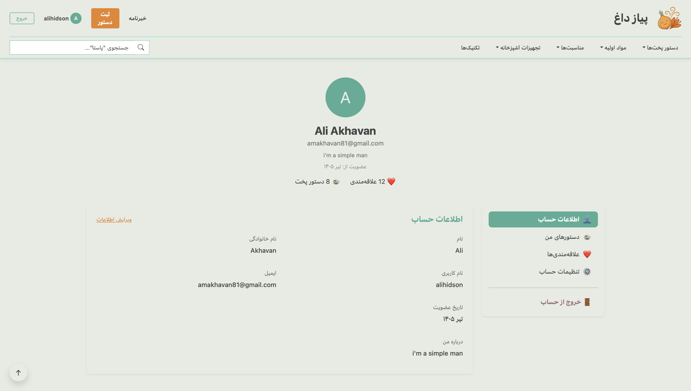
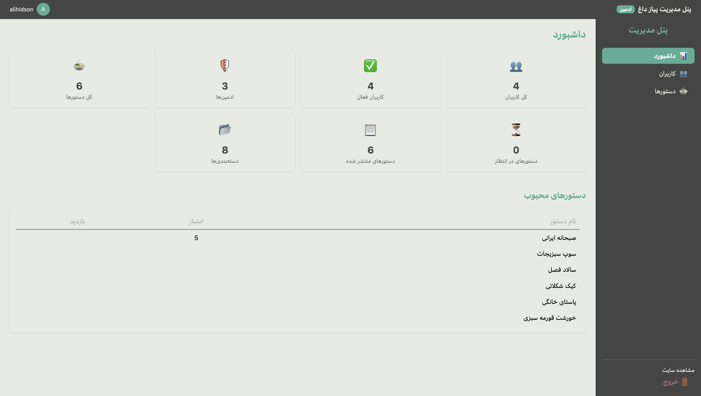
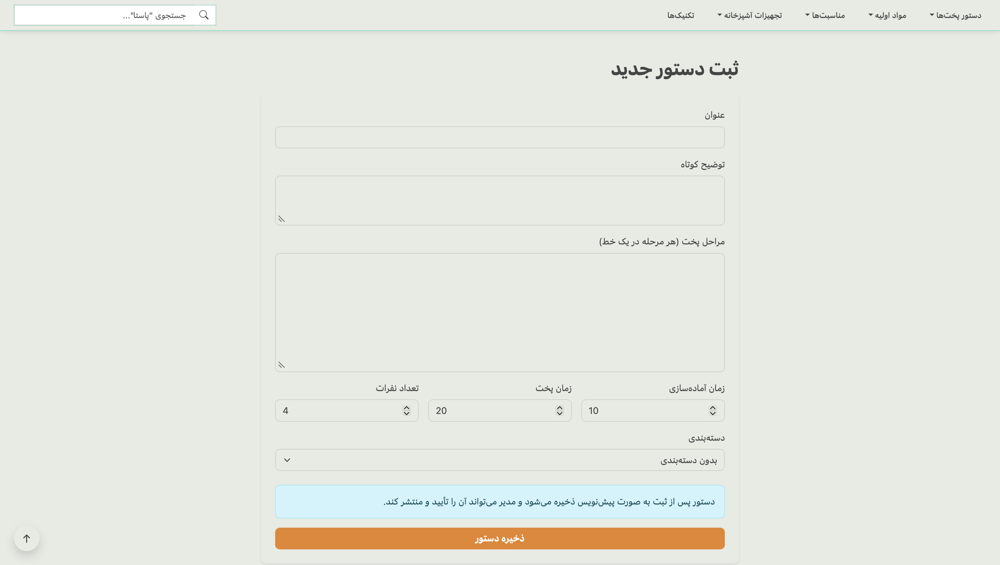

# 🍳 PiazDagh

PiazDagh is a modern, responsive cooking web application that allows users to discover, search, and share cooking recipes with images. The project is built as a full-stack web application using **React**, **Bootstrap**, **Django REST Framework**, and **PostgreSQL**, and is fully containerized with **Docker** for easy deployment on any operating system.

---

## ✨ Features

### 👨‍🍳 User Features

- User registration and authentication
- Secure JWT-based login
- Responsive user interface
- Browse cooking recipes
- Search and filter recipes
- View detailed recipe pages
- Upload recipes with food images
- Manage personal profile
- View personal recipes
- Add recipes to favorites

### 🔧 Backend Features

- RESTful API built with Django REST Framework
- JWT Authentication
- PostgreSQL database
- Full CRUD operations for recipes
- Image upload support
- Search and filtering
- User role management
- Dockerized architecture

### 👨‍💼 Administration

- Django Admin Panel
- User management
- Recipe management
- Recipe approval workflow
- Category management
- Dashboard statistics

---

# 🛠 Tech Stack

### Frontend

- React
- React Router
- Bootstrap 5
- Axios

### Backend

- Django
- Django REST Framework
- Simple JWT
- PostgreSQL

### DevOps

- Docker
- Docker Compose

---

# 🗄 Database

The application uses **PostgreSQL** as its primary database.

The backend communicates with PostgreSQL through Django ORM.

Database data is persisted using Docker volumes, so restarting containers does not remove the stored data.

---

# 🔗 API

The frontend communicates with the backend exclusively through REST APIs.

Main API modules include:

- Authentication
- User Profile
- Recipes
- Categories
- Favorites
- Reviews
- Admin Management

Example:

```
GET    /api/recipes/
POST   /api/recipes/
PATCH  /api/recipes/{id}/
DELETE /api/recipes/{id}/
```

---

# 🐳 Running with Docker

The project is fully containerized.

Supported operating systems:

- ✅ Windows
- ✅ Linux
- ✅ macOS

## Prerequisites

Install:

- Docker
- Docker Compose
- Git

---

## Clone Repository


```bash
git clone https://github.com/alihidson/PiazDagh.git
```

Go to the project folder:

```bash
cd PiazDagh
```

---

## Run the Project (Make sure you connect to a strong VPN)

Build and start all services:

```bash
docker compose up --build
```

Or run in detached mode:

```bash
docker compose up --build -d
```

---

# 🌐 Application URLs

Frontend:

```
http://localhost:5173
```

Backend API:

```
http://localhost:8000/api/
```

Django Admin:

```
http://localhost:8000/admin/
```

---

# 👤 Create an Admin User

Create a Django administrator:

```bash
docker compose exec backend python manage.py createsuperuser
```

Follow the prompts to create the administrator account.

---

# 🛑 Stop the Project

```bash
docker compose down
```

To also remove the PostgreSQL database volume:

```bash
docker compose down -v
```

---

# 📦 Docker Services

The application consists of three containers:

- frontend
- backend
- PostgreSQL database

Docker Compose automatically creates the required network and volumes.

---

# 📸 Screenshots

> Add screenshots of the application here.

Example:


## Recipes




## Home Page




## Details




## Comments




## Login - Signup




## User Panel




## Admin Panel




## Add Recipes




---

## 👨‍💻 Authors

- **Ali Akhavan**
  Developed the backend using **Django** and **Django REST Framework**, designed and managed the **PostgreSQL** database, developed the REST APIs, and containerized the application using **Docker**.

- **Sepehr Jafarzadeh**
  Developed the responsive frontend using **React** and **Bootstrap**, focusing on a modern and user-friendly interface.


